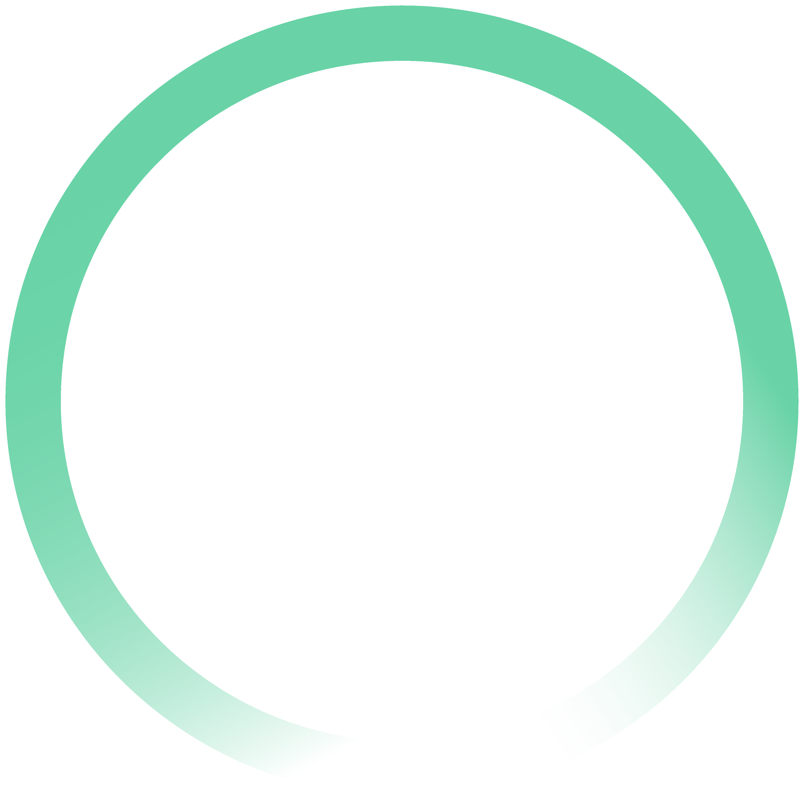

###

<h1 align="left">Hey! :wave:</h1>

###

I'm Juan Arias from Colombia :colombia:, and I'm currently pursuing a degree in Systems Engineering. My commitment is to always learn something new, have a great day! :wink:

###

 

<h2 align="left">Currently learning/coding with:</h2>

###

  
  
  
  
  
  
  
  
  
  
  
  
  
  
  
  
  
  
  

###

###
